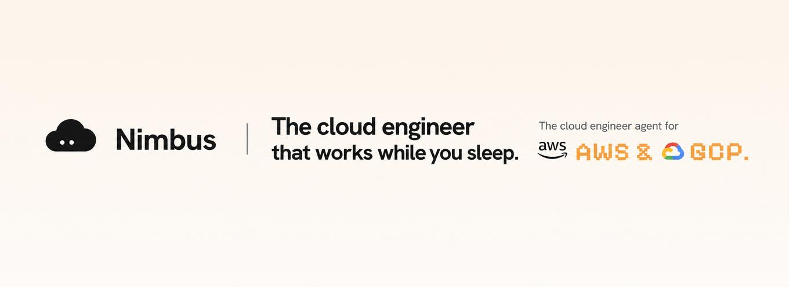

<div align="center">


# Nimbus

**Talk to your cloud.**

An AI-powered cloud control plane. One agent that reads your code, understands your
architecture, acts on real AWS &amp; GCP credentials, and fixes your repos — all through
plain conversation.

[](LICENSE)
[](https://nodejs.org)
[](https://react.dev)
[](https://vitejs.dev)



</div>

---

## What is Nimbus?

Instead of switching between cloud consoles, terminals, CI dashboards and IaC files, you work
in **one place** with an agent that can design infrastructure, deploy it, watch it, and repair
the code behind it. Think of it as a senior platform engineer that lives inside your team chat.

Nimbus is built around three ideas:

- **Intent-driven operations** — describe the outcome you want; Nimbus produces a plan, you
  approve it, it executes. Reads are autonomous; every write is confirmed.
- **One shared workspace per project** — channels, cloud connections, machines, repairs and the
  architecture canvas are shared with your team. Only your private chat with Nimbus stays personal.
- **Real execution, with evidence** — every claim is grounded in something the agent actually
  read or ran (a file, a log, a live resource), and every change is auditable.

## Features

| | |
|---|---|
| 💬 **Conversational agent** | A ReAct chat loop with tool use — inspect inventory, read logs &amp; telemetry, estimate cost, deploy, and open PRs. Design mode sketches architecture; Agent mode operates the real clouds. |
| 🎨 **Live architecture canvas** | Ask Nimbus to design a system and watch the nodes render live (React Flow) — load balancer → app → database → cache. |
| ☁️ **Multi-cloud** | Connect **AWS** (keys or IAM role, short-lived STS) and **GCP** (service-account JSON or keyless *Connect with Google* OAuth) via per-user, per-project MCP servers. |
| 🧭 **Live cloud data** | Overview, Resources and Cost pull real inventory, telemetry and spend once a cloud is connected. |
| 🛠️ **Shared-compute repairs** | Connect a laptop or CI runner; Nimbus drives your local **Claude Code** turn-by-turn to fix a repo, then pushes a branch and opens a PR. Machines are pooled per project. |
| 🔌 **GitHub &amp; more** | Connect repositories through Composio; the agent reads your code, PRs and CI before acting. |
| 👥 **Teams &amp; permissions** | Invite by email; per-member toggles for Channels, Machines &amp; repairs, and Cloud &amp; resources. |
| 🔐 **Secure by design** | Credentials encrypted at rest (AES-256-GCM), never printed or logged; membership-enforced access; server-side audit trail. |

## Architecture

Nimbus is a **React SPA** talking to a **thin Express API** that fans out to services,
repositories, agents and per-user cloud MCP servers. A separate **CLI worker** connects
outside machines for repairs.

```
┌──────────────────────┐        ┌───────────────────────────────────────────────┐
│  Web app (Vite/React)│  /api  │  API server (Express)                          │
│  localhost:5280      │ ─────► │  localhost:8788                                │
│  • chat + canvas     │  proxy │                                                │
│  • dashboard         │        │  routes/       → HTTP handlers (per resource)  │
│  • connections       │        │  services/     → cloud, telemetry, cost, spec… │
└──────────────────────┘        │  repositories/ → SQLite persistence            │
                                │  agents/       → ReAct chat loop + analysis    │
┌──────────────────────┐        │  tools/        → agent tools (canvas, repair…) │
│  Connected machine   │  poll  │  libs/         → model, MCP, composio, aws/gcp │
│  @nimbus/cli + Claude │ ◄────► │  mcp/          → aws / gcloud / cloud-run MCP  │
│  Code (your laptop)  │  (PR)  └───────────────────────────────────────────────┘
└──────────────────────┘                    │
                                 SQLite (better-sqlite3) · creds encrypted at rest
```

User identity comes **strictly from the session cookie**; `req.user.id` is the isolation
boundary every service and MCP call is scoped to.

### Tech stack

- **Frontend** — React 18, Vite 5, React Router, React Flow, `@ai-sdk/react`, react-markdown
- **Backend** — Node ≥ 20, Express, `better-sqlite3`, Helmet, Zod
- **AI** — Vercel AI SDK (`ai`), Databricks (primary) with OpenRouter cross-provider fallback,
  Model Context Protocol (`@modelcontextprotocol/sdk`)
- **Integrations** — Composio (GitHub), AWS &amp; GCP MCP servers, Fly.io (provisioning / rented machines)

## Run with Docker (recommended)

The fastest way to run Nimbus. The image bundles everything the cloud MCP servers need —
`git`, `uv` (AWS), the `gcloud` CLI (GCP) and Node — so there's nothing else to install. You only
provide your `.env`.

```bash
git clone https://github.com/hritvikgupta/nimbus.git
cd nimbus
cp .env.example .env

# 1. Generate the master encryption key and append it to .env (protects stored credentials):
echo "NIMBUS_ENC_KEY=$(openssl rand -base64 32)" >> .env

# 2. Open .env and fill in your AI model — LLM_PROVIDER, LLM_MODEL, OPENROUTER_API_KEY.
#    (Optional: FLY_API_TOKEN to rent machines, COMPOSIO_API_KEY for GitHub.)

# 3. Run it:
docker compose up --build
# open http://localhost:8788
```

> No `openssl`? Use `node -e "console.log(require('crypto').randomBytes(32).toString('base64'))"` and paste the result as `NIMBUS_ENC_KEY=` in `.env`.

One container serves the app **and** the API on port `8788`. Your data (the SQLite DB + encrypted
connections) persists in the `nimbus-data` volume across restarts.

> Prefer plain `docker`? `docker build -t nimbus . && docker run -p 8788:8788 --env-file .env -v nimbus-data:/app/server/.data nimbus`

To run from source instead (for development), follow the steps below.

## Quick start (from source)

### Prerequisites

- **Node.js ≥ 20** and npm
- An **LLM provider** — a Databricks serving endpoint *or* an OpenRouter API key
- *(optional)* a **Composio** API key for GitHub, and AWS/GCP credentials to connect real clouds
- For the cloud MCP servers: [`uv`](https://docs.astral.sh/uv/) (AWS) and the
  [`gcloud` CLI](https://cloud.google.com/sdk/docs/install) (GCP) — bundled automatically in Docker

### 1. Install

```bash
git clone https://github.com/hritvikgupta/nimbus.git
cd nimbus
npm install
```

### 2. Configure

```bash
cp .env.example .env
```

Fill in `.env` (see [Configuration](#configuration)). At minimum, set a `NIMBUS_ENC_KEY` and one
LLM provider:

```bash
# generate the master encryption key
node -e "console.log(require('crypto').randomBytes(32).toString('base64'))"
```

### 3. Set up the cloud MCP servers

The agent talks to your clouds through three MCP servers vendored under
[`server/mcp/`](server/mcp) — **AWS** (`aws-mcp`, Python via `uvx`), **Cloud Run**
(`cloud-run-mcp`) and **gcloud** (`gcloud-mcp`). Their source lives in the repo; install their
dependencies (and build the gcloud bundle) once:

```bash
npm run setup:mcp
```

This runs `npm install` for the Node servers, builds `gcloud-mcp`, and checks for
[`uv`](https://docs.astral.sh/uv/) (needed to launch the AWS server). You can skip this if you
only use one cloud — the corresponding server is only spawned when a matching connection exists.

**Host prerequisites** (the MCP servers shell out to these — install the ones for the clouds you use):

| Cloud | Requires on the host | Why |
|---|---|---|
| **AWS** | [`uv`](https://docs.astral.sh/uv/) | Launches `aws-api-mcp-server` (Python); pulls its deps from PyPI on first run. Gives the full `call_aws` tool. |
| **GCP** | the [`gcloud` CLI](https://cloud.google.com/sdk/docs/install) on `PATH` | `gcloud-mcp` executes `gcloud` commands — the full `run_gcloud_command` surface. |

Once installed, the agent has the **complete AWS and gcloud command surface** plus Cloud Run
deploy/logs — the servers themselves are the full upstream implementations, not trimmed subsets.
You still connect your own cloud credentials in the app (**Connections**).

### 4. Run

Nimbus is two processes — the API and the web app. Run them in two terminals:

```bash
npm run api     # backend  → http://localhost:8788
npm run dev     # frontend → http://localhost:5280   (proxies /api to :8788)
```

Open **http://localhost:5280**, create an account, and the guided walkthrough will introduce
the workspace. Connect a repo and a cloud from **Connections**, then start chatting.

## Configuration

All configuration is via environment variables in `.env` (loaded by `npm run api`).

| Variable | Required | Description |
|---|---|---|
| `NIMBUS_ENC_KEY` | **yes** (prod) | Base64 32-byte master key; encrypts cloud credentials at rest (AES-256-GCM). |
| `LLM_PROVIDER` | yes | `databricks` or `openrouter`. |
| `LLM_MODEL` | yes | Model id for the selected provider. |
| `DATABRICKS_HOST` / `DATABRICKS_TOKEN` / `DATABRICKS_MODEL` | if databricks | Primary serving endpoint. |
| `OPENROUTER_API_KEY` | if openrouter | Cross-provider fallback / primary. |
| `COMPOSIO_API_KEY` | optional | GitHub (and other app) connections. |
| `GITHUB_TOKEN` | optional | Higher GitHub API rate limits. |
| `GOOGLE_OAUTH_CLIENT_ID` / `GOOGLE_OAUTH_CLIENT_SECRET` | optional | GCP keyless *Connect with Google*. |
| `FLY_API_TOKEN` / `FLY_ORG` / `FLY_REGION` / `FLY_APP` / `FLY_MACHINE_IMAGE` | optional | Provisioning &amp; rented machines. |
| `AGENT_PORT` | optional | API port (default `8788`). |
| `APP_URL` | optional | Public app URL — GCP OAuth redirects + links (dev `http://localhost:5280`; Docker `http://localhost:8788`). |
| `ALLOW_SIGNUP` | optional | `false` closes registration on public deploys. |
| `AGENT_DAILY_LIMIT` | optional | Per-user daily cap on expensive agent/cloud actions. |
| `CORS_ORIGINS` | optional | Comma-separated allowlist; empty = same-origin only. |
| `DOCS_HOST` | optional | Extra host to serve docs from (besides `docs.*`). |
| `OPS_SCAN_MINUTES` | optional | `> 0` enables the scheduled incident scan. |
| `WEBHOOK_BASE` | optional | Public base URL for inbound webhooks. |

**What you actually need:**

- **Always:** `NIMBUS_ENC_KEY` + an AI model (`LLM_PROVIDER` + `LLM_MODEL` + `OPENROUTER_API_KEY`, or the Databricks trio). Your provider, your key, your billing.
- **To rent machines (Fly):** your own `FLY_API_TOKEN` (+ optional `FLY_*`). Leave blank to disable the feature. Rented machines need **no public URL** — the worker runs inside this server and drives Fly via its API. The person renting supplies their own coding-agent key per rental in the UI.
- **To connect your own laptop/CI for repairs:** nothing here — that machine runs the [`@nimbus/cli`](cli/README.md) worker and *polls* this server, so **it** is pointed at Nimbus (`nimbus start <key> --url https://your-host`), not the other way around.
- **When hosting publicly:** set `APP_URL` to your real URL (used for GCP OAuth redirects + links), and optionally `WEBHOOK_BASE`, `CORS_ORIGINS`, `ALLOW_SIGNUP=false`.

> **Never commit your real `.env`.** It is gitignored; `.env.example` is the template.

## Connect a machine (repairs)

Repairs run on real machines you own via the [`@nimbus/cli`](cli/README.md) worker. It polls
Nimbus (outbound only — works behind any NAT/firewall); when a fix is dispatched it clones the
repo, drives your local Claude Code to find and fix the issue, and opens a PR.

```bash
npm install -g @nimbus/cli
# In the app: Repairs → Connect a machine → Generate key
nimbus start <worker-key>
```

The machine needs **Claude Code** (installed + logged in), **git**, and **gh**. See
[`cli/README.md`](cli/README.md) for the full worker docs.

## Project structure

```
nimbus/
├── src/                 # React SPA — pages, components, context, styles
├── server/              # Express API
│   ├── server.mjs       #   thin HTTP entry — mounts routers
│   ├── routes/          #   HTTP handlers (one file per resource)
│   ├── services/        #   business logic (cloud, telemetry, cost, spec, repair…)
│   ├── repositories/    #   persistence (SQLite via better-sqlite3)
│   ├── agents/          #   ReAct chat loop + codebase-analysis agent
│   ├── tools/           #   agent tools (canvas, repair, telemetry, code…)
│   ├── libs/            #   external clients (model, MCP, composio, aws, gcp)
│   ├── mcp/             #   AWS / gcloud / Cloud Run MCP servers
│   └── middlewares/     #   session auth + cloud scoping
├── cli/                 # @nimbus/cli — the connected-machine repair worker
├── docs-site/           # Fumadocs documentation site (statically exported)
├── deploy/              # Fly.io deploy configs (landing + docs)
├── docs/               # architecture & design docs (production-readiness, rented-compute…)
└── public/              # static assets (logos, brand)
```

## Deployment

Nimbus targets **[Fly.io](https://fly.io)**. The API server also serves the statically-exported
docs site (from `docs-site/out`) whenever the request host matches `docs.*`, so `docs.yourdomain`
needs no separate process.

```bash
cd docs-site && npm run build     # regenerate docs-site/out
# then deploy the API + built SPA to Fly (see docs/production-readiness)
```

Production hardening — deploy architecture, security tiers and scaling — is documented under
[`docs/production-readiness/`](docs/production-readiness).

## Security

- **Credentials encrypted at rest** with AES-256-GCM; the master key (`NIMBUS_ENC_KEY`) lives only
  in the environment.
- **Secrets are never printed, logged, or returned** in chat or API responses.
- **Plan-then-act** — the agent never creates, scales, modifies or deletes a billable resource
  without showing a plan and getting explicit confirmation.
- **Membership-enforced access** on the server for every project-scoped action.
- Cloud MCPs run with **only the project's credentials**; AWS STS / GCP tokens are short-lived.

Found a vulnerability? See [SECURITY.md](SECURITY.md). Please do **not** open a public issue.

## Contributing

Contributions are welcome — see [CONTRIBUTING.md](CONTRIBUTING.md) for the dev setup, conventions,
and PR process.

## License

[MIT](LICENSE) © Nimbus contributors
